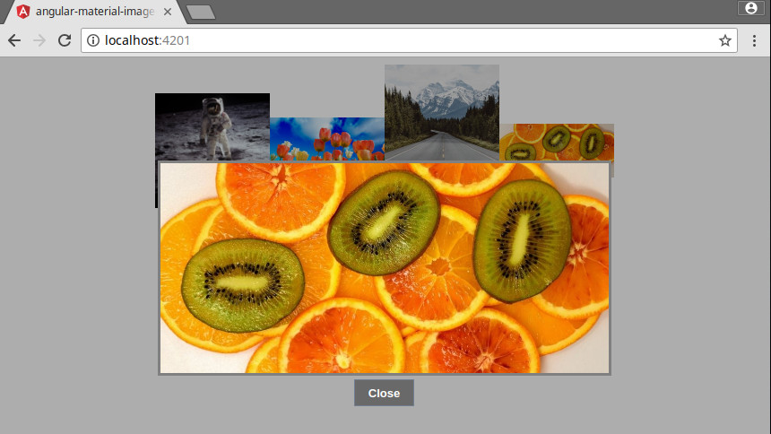

angular-material-image-overlay
==============================
An image overlay based on [Angular Material](https://material.angular.io/). Try out the [demo page](https://rafasantos.github.io/angular-material-image-overlay/)



Quick Start
-----------
Install the package:

```
npm install angular-material-image-overlay
```

Configure your angular application module (e.g: `app.module.ts`):
```
...
import { AngularMaterialImageOverlayModule, AngularMaterialImageOverlayComponent } from 'angular-material-image-overlay';

@NgModule({
  ...
  imports: [
    ...
    AngularMaterialImageOverlayModule
  ]
})
export class AppModule { }
```

Open the images via `AngularMaterialImageOverlayService.open(imageUrls: string[])`
```
imageUrls = [
  'https://plixs.com/public/uploads/preview/plixs-photo-31231544218415smhm2g5a1u.jpg',
  'https://plixs.com/public/uploads/preview/rope-node-solid-maritime-4361524216895fj1pvztgd1.jpg',
  'https://plixs.com/public/uploads/preview/plixs-photo-31231544218168fgcal7xkxe.jpg',
  'https://plixs.com/public/uploads/preview/plixs-photo-31231544217590vwh6204yse.jpg'
];

constructor(private imageOverlayService: AngularMaterialImageOverlayService) {
}

openImageOverlay(): void {
  this.imageOverlayService.open(this.imageUrls);
}
```

AngularMaterialImageOverlayDemo
===============================
Demo project to show case how `angular-material-image-overlay` works.

```
git clone https://github.com/rafasantos/angular-material-image-overlay.git
cd angular-material-image-overlay
npm start
```

Navigate to http://localhost:4200

Development
-----------
`${APP_ROOT_FOLDER}` references the root folder of the application typically the git repository root folder.

Build the project and override the local `angular-material-image-overlay` installation. Userfull when you want to make changes to the project and test it locally.
```
npm run build-dev
```

Build the project to the distribution folder: `${APP_ROOT_FOLDER}/dist/angular-material-image-overlay`
```
cd ${APP_ROOT_FOLDER}
ng build angular-material-image-overlay
ls dist/angular-material-image-overlay
```

Installing the package manually into a different project without `npm install`. This is only recommended for prototyping.
```
cd ${APP_ROOT_FOLDER}
cp -r dist/angular-material-image-overlay/ ${YOUR_APP}/node_modules/
```

When publishing, first update the versions on `package.json` and `projects/angular-material-image-overlay/package.json`; then test, build and publish it to `npm`.
```
cd ${APP_ROOT_FOLDER}/dist/angular-material-image-overlay
npm publish
```

License
=======
Code released under the (MIT license)[LICENSE]